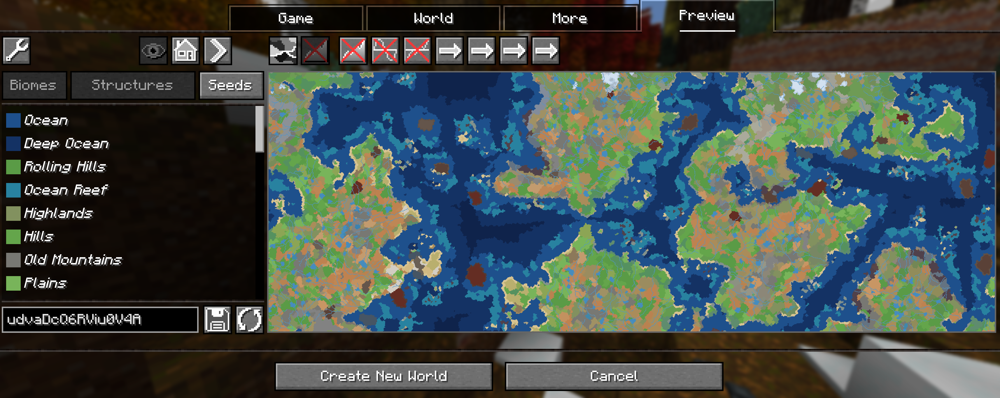
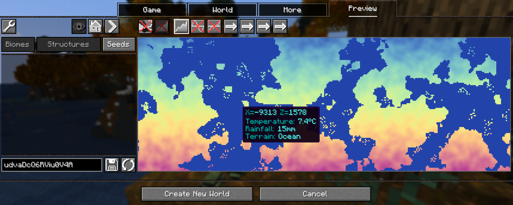
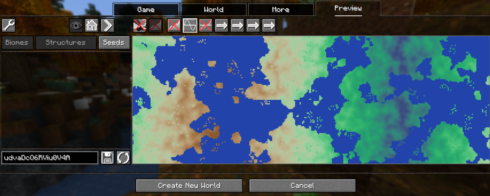
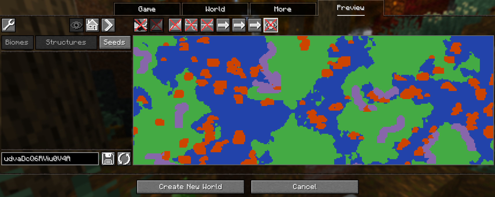
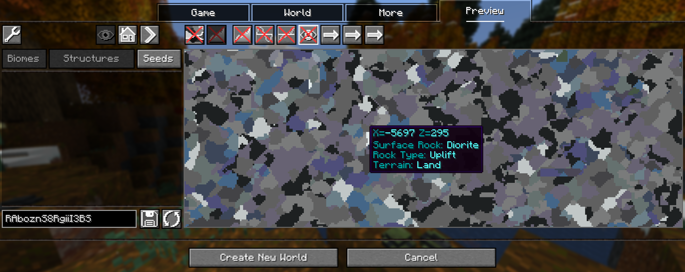

# World Preview TFC
Fork of https://www.curseforge.com/minecraft/mc-mods/world-preview
*World Preview* is a mod for visualizing Minecraft world seeds before they are generated.
*World Preview TFC* implements the ability to use TFC custom world generation settings and display maps of the tempature, rainfall and rock types.
Download here [modrinth]() and [CurseForge]()!

## Installation

Just download the latest *World Preview TFC* JAR file for your ***exact*** Minecraft version.
Make sure you have TFC installed as well as Neoforge
Then save the downloaded jar to the `mods` folder of your Minecraft instance.

## Usage

Biomes Map Mode

Temperature Map Mode

Rainfall Map Mode

Rock Type Map Mode

Rock Layers Map Mode

##### Moving on the preview

Clicking and dragging on the map-part of the preview tab will move along the x and z axis.
This will cause the following load sequence:
- Any biomes that are not yet sampled on the current y-level
- Structures (if enabled)
- Height map (if enabled)

##### Other features

- Persistent seed storage
- Highlighting specific biomes
- Highly configurable and extendable

## Supported version

TFC 4+
Minecraft 1.21.1

## Mod incompatibilities

None known, it should work with Beneath and TFC Real World
