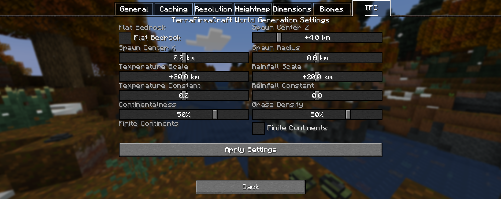
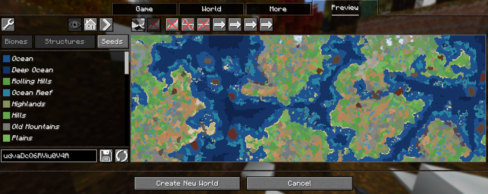
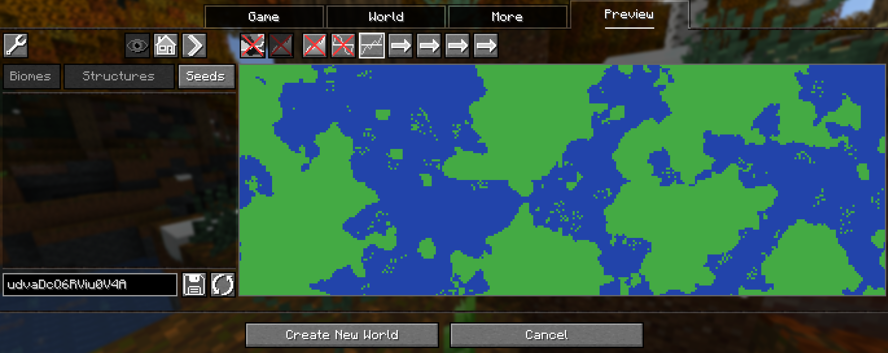
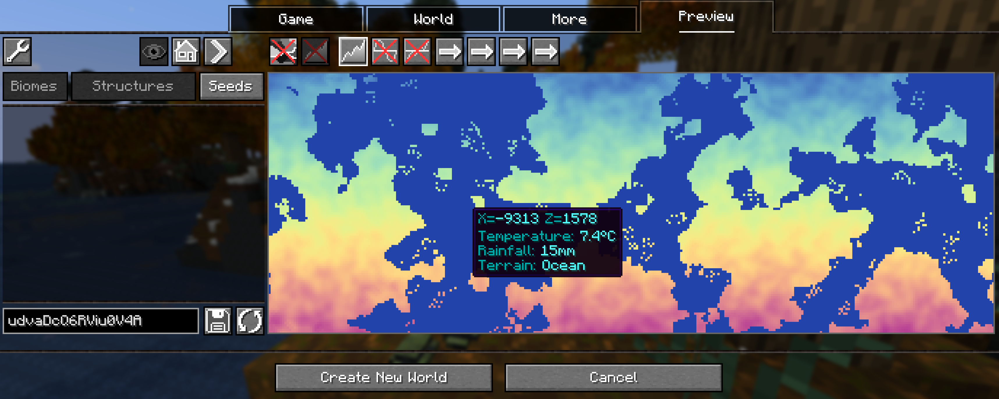
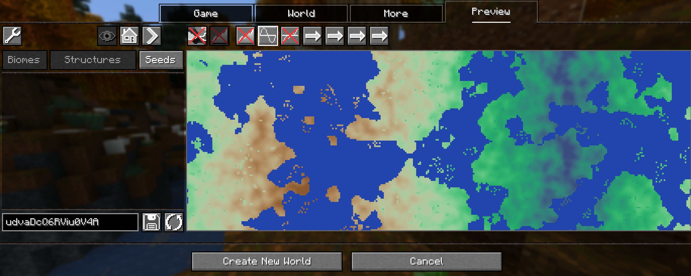
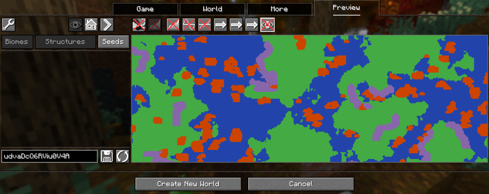
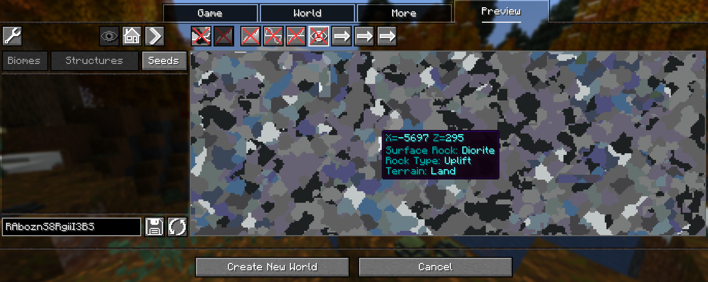

# World Preview TFC
Fork of [World Preview](https://www.curseforge.com/minecraft/mc-mods/world-preview).
World Preview TFC adds a World Preview tab to the Create World screen and uses TerraFirmaCraft (TFC) world generation to preview seeds.
It can visualize biomes, temperature, rainfall, land and water, rock types, rock layers, kaolin clay areas and hotspots.

Downloads: Modrinth (https://modrinth.com/mod/world-preview-terrafirmacraft) and CurseForge (https://www.curseforge.com/minecraft/mc-mods/world-preview-tfc).
Issue tracker: https://github.com/TKFT/World-Preview-TFC/issues

## Requirements
- Minecraft 1.21.1
- NeoForge 21.1.213+ (21.1.218 recommended)
- TerraFirmaCraft (TFC) 4.0.17+
- Java 21

## Installation
1. Install NeoForge for Minecraft 1.21.1.
2. Install TerraFirmaCraft (TFC) 4.0.17+.
3. Place the World Preview TFC jar in your instance `mods` folder.

## Usage
Open `Create New World` and switch to the `World Preview` tab. Drag on the map to move along X and Z. This will load:
- Biomes
- Heightmap (if enabled)
- Rainfall Map
- Temperature Map
- Land/Water/River Map
- Rock Layer Maps
- Rock Type Map
- Kaolin Clay Areas Map
- Hotspot Map
- Volcano Icons

### TFC Settings Tab

### Map Modes

Biomes Map Mode

Land and Water Map Mode

Temperature Map Mode

Rainfall Map Mode

Rock Type Map Mode

Rock Layers Map Mode

## Other Features
- Persistent seed storage
- Highlighting specific biomes
- Highly configurable and extendable
- Seed Searching
- Volcano Icons

## Compatibility
- Incompatible with the original World Preview Neoforged mod (mod id `world_preview`)
- No other known incompatibilities; reported to work with Beneath

## TODO
- Add compatibility with other worldgen mods like Real World and Eratosthenes
