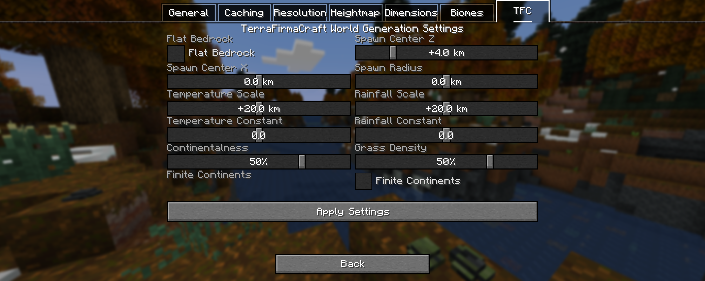
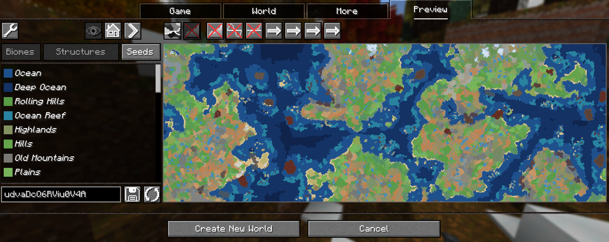
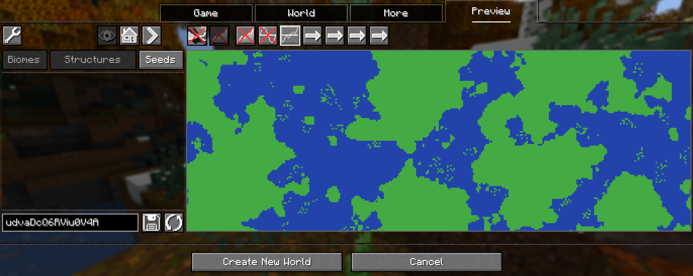
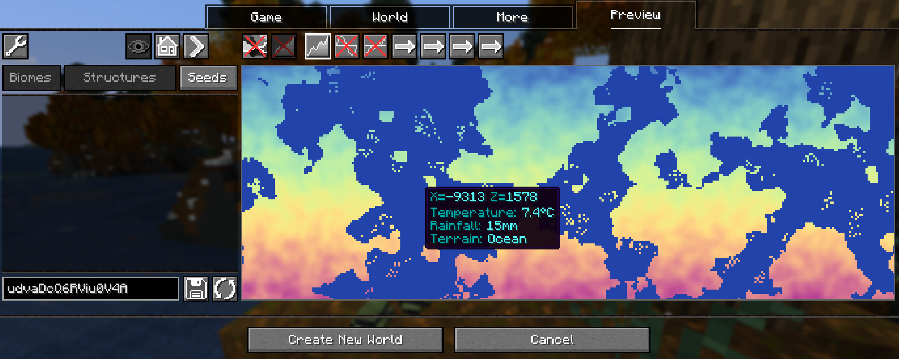
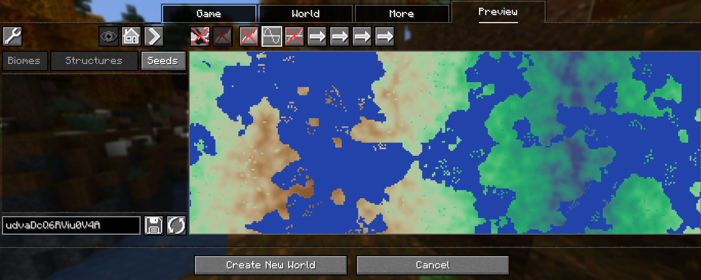
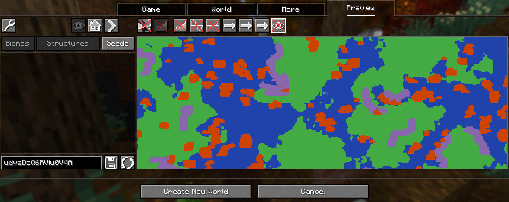
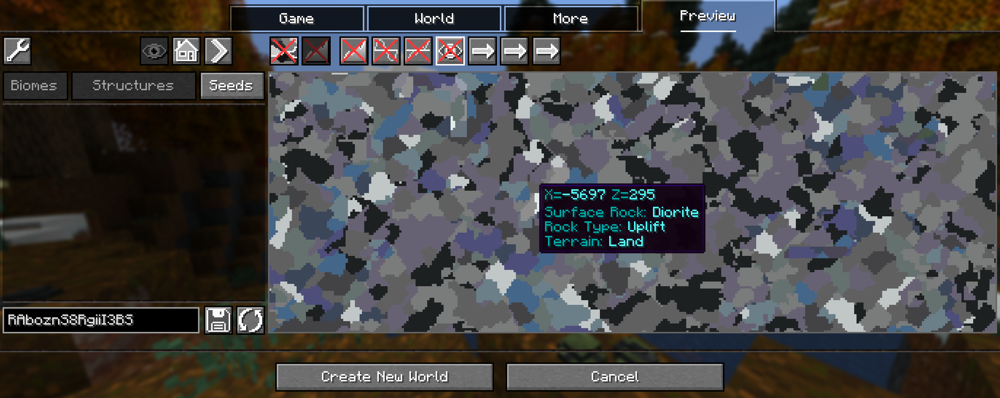

# World Preview TFC
Fork of [World Preview](https://www.curseforge.com/minecraft/mc-mods/world-preview).
World Preview TFC adds a World Preview tab to the Create World screen and uses TerraFirmaCraft (TFC) world generation to preview seeds.
It can visualize biomes, temperature, rainfall, land and water, rock types, rock layers, kaolin clay areas and hotspots.

Downloads: Modrinth (https://modrinth.com/mod/world-preview-terrafirmacraft) and CurseForge (https://www.curseforge.com/minecraft/mc-mods/world-preview-tfc).
Issue tracker: https://github.com/TKFT/World-Preview-TFC/issues

## Requirements
- Minecraft 1.21.1
- NeoForge 21.1.213+ (21.1.218 recommended)
- TerraFirmaCraft (TFC) 4.0.17+
- Java 21

## Installation
1. Install NeoForge for Minecraft 1.21.1.
2. Install TerraFirmaCraft (TFC) 4.0.17+.
3. Place the World Preview TFC jar in your instance `mods` folder.

## Usage
Open `Create New World` and switch to the `World Preview` tab. Drag on the map to move along X and Z. This will load:
- Biomes
- Heightmap (if enabled)
- Rainfall Map
- Temperature Map
- Land/Water/River Map
- Rock Layer Maps
- Rock Type Map
- Kaolin Clay Areas Map
- Hotspot Map
- Volcano Icons

### TFC Settings Tab

### Map Modes

Biomes Map Mode

Land and Water Map Mode

Temperature Map Mode

Rainfall Map Mode

Rock Type Map Mode

Rock Layers Map Mode

### Large TFC Map Exports

Open **Settings -> Map Export** after the preview finishes loading. Select any combination of
**Biomes**, **Land / Water**, **Terrain**, **Temperature**, and **Rainfall**. Exports use the active
seed, dimension, TFC settings, datapacks, biome-source modifications, and installed worldgen mods.
The center defaults to `0,0`; negative block coordinates are supported.

| Preset | Block coverage | Blocks per pixel | Quart samples per pixel | PNG dimensions |
|---|---:|---:|---:|---:|
| 50k | 50,000 x 50,000 | 4 | 1x1 | 12,500 x 12,500 |
| 100k | 100,000 x 100,000 | 8 | 2x2 | 12,500 x 12,500 |
| 200k | 200,000 x 200,000 | 16 | 4x4 | 12,500 x 12,500 |

Every output is an 8-bit indexed PNG with a layer-specific palette:

- **Biomes:** final active `BiomeSourceExtension` values, including rivers and compatible
  biome-source changes, colored with World Preview's loaded biome mapping. Index 0 is the
  deterministic unknown fallback. At most 255 registered biomes receive dedicated entries.
- **Land / Water:** index 0 is the configured fixed land color; indexes 1-16 are subtle water
  shades around the configured water color. Ocean, trench, river, lake, channel, mouth, and
  compatible addon water biomes count as water; shores and beaches remain land. Any narrow-water
  sample preserves a coarse pixel, otherwise at least half its samples must be open water.
- **Terrain:** index 0 water (`#24558F`), 1 lowland (`#6E9F57`), 2 midland/plains (`#A9B96E`),
  3 highland (`#8C805F`), and 4 mountain (`#D8D8D8`). Final-biome water takes priority, then
  `Region.Point.mountain()` and `discreteBiomeAltitude()` select the land class.
- **Temperature:** 256 entries from the active World Preview TFC temperature colormap, spanning
  -23 C through 33 C.
- **Rainfall:** 256 entries from the active World Preview TFC rainfall colormap, spanning
  0 through 500 mm.

Land/water's slight blue variation is diagnostic continent-cell shading, not ocean-depth shading.
It comes from TFC's deterministic `RegionGenerator.cellNoise` value and stays within approximately
+/-8% of the configured water color, making continent-cell structure visible without obscuring
coastlines. Coarse pixels average only water-sample shade buckets; land never affects the shade.

Exports are written to `<Minecraft instance>/world-preview-exports/` as a standalone PNG plus a
companion JSON file. Filenames include the sanitized entered seed, preset, layer, and center.
Metadata records the entered and numeric seeds, dimension, exact inclusive bounds, layer, sampling
resolution, palette mode, water-shading flags, effective TFC temperature/rainfall scales, timestamp,
World Preview version, TFC version, and TFC Large Biomes version when present.

The exporter never creates or loads chunks. It samples TFC worldgen directly and streams filtered
rows through a bounded ordered pipeline. A stripe is 64 rows, and at most the configured worker
count (capped at eight) is in flight. For a 12,500-wide image, eight stripe buffers occupy about
6.1 MiB, plus roughly 0.1 MiB for PNG compression/chunk buffers; no full-image buffer is allocated.

Runtime depends heavily on CPU and worldgen addons. Each preset always writes 156.25 million
pixels, while sampling work grows from one quart per pixel at 50k to four at 100k and sixteen at
200k. Expect 100k to take roughly four times the 50k sampling time and 200k roughly sixteen times,
with biome and terrain layers generally more expensive than writing the PNG itself. TFC Large
Biomes is compatible because sampling uses the active final biome source and effective TFC settings.

The UI remains responsive and shows the current layer, preset, overall percentage, elapsed time,
ETA, and output directory. Cancel interrupts workers, cancels every in-flight stripe, closes the
writer, and removes `.part` files. The final PNG is moved into place only after both the image and
metadata are complete.
## Other Features
- Persistent seed storage
- Highlighting specific biomes
- Highly configurable and extendable
- Seed Searching
- Volcano Icons

## Compatibility
- Incompatible with the original World Preview Neoforged mod (mod id `world_preview`)
- No other known incompatibilities; reported to work with Beneath

## TODO
- Add compatibility with other worldgen mods like Real World and Eratosthenes
